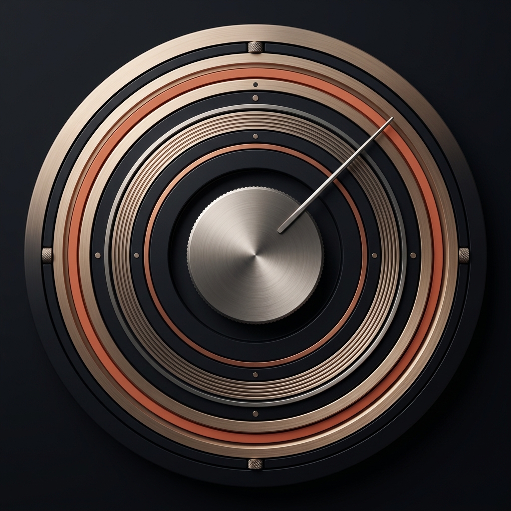

<p align="center"></p>

# AURA

**Your music. On your phone. Offline.**

AURA is a personal Android music player built for listening to songs already stored on a phone. A restrained dark interface puts album artwork and playback first.

## Why I built it

I wanted an offline player for college, using my own local music library. I also wanted to learn by building an idea I cared about, rather than only following tutorials or attending hackathons. AURA has evolved through daily listening, feedback, and repeated refinements. Development is AI-assisted; the project documents tested behavior honestly instead of claiming every problem is solved.

## What makes it useful

- Real on-device library: songs, albums, artists, downloaded audio in shared storage, and local playlists.
- Search across song, artist, and album metadata, with artwork on results.
- An artwork-led Home screen, recent listening, and a sideways shelf containing all favourites.
- Full and mini players with seeking, queue editing, shuffle and repeat.
- Adjustable crossfades between local tracks and metadata-based autoplay that avoids recent repeats.
- Tap-to-select mood mixes based on songs you assign. This is not AI mood classification.
- A sleep timer adjustable from zero to sixty minutes.
- Cover-derived player and widget colours, with black when real artwork is unavailable.
- Configurable home-screen music widgets and Android media notifications.
- Spatial audio and Dolby settings access where the device exposes compatible controls; no promise of Atmos decoding for every file.
- Sampled cover decoding, memory and disk caching, upcoming-cover preparation, and a logo startup screen.

## Privacy and offline scope

The app requests access to local audio and has no Internet permission. No account, hosted backend, streaming catalogue, analytics, or music-download service is required. Artwork and playlists stay in app storage. Songs are not bundled with this repository; privately stored streaming-service downloads cannot be read as ordinary audio files.

## Install

Download the debug APK from [Releases](../../releases). It is a testing build, not a Google Play production release. Allow audio access when prompted. Keep your files in shared Music or Download storage; use Library → Refresh music when needed. Updates retain saved data when installed over the existing app with the same signing key. Uninstalling removes app preferences.

## Build

Requirements: JDK17, Android SDK35, Android Build Tools35.0.0. Open this repository in Android Studio, configure your SDK through `local.properties`, then run:

```sh
./gradlew :app:assembleDebug :app:lintDebug
```

The private development signing key is not published. Your own build uses Android Studio's standard local debug key. A differently signed build cannot replace the published APK without uninstalling it first.

## Project structure

- `app/src/main/java/dev/lilt/player/`: native screens, local library, playback service, artwork, search, queue rules and widgets.
- `app/src/main/res/`: logo, icons, themes and widget layouts.
- `tests/`: plain-Java logic tests.
- `docs/`: branding and release history.

Stack: Java17, native Android views, MediaStore, AndroidX Media3. Minimum Android8/API26. Current compile/target SDK35; Android16 compatibility testing is still pending.

## Verification and current limits

The current source builds and passes lint with no errors. 211 plain-Java logic checks and48 structural/contrast checks passed in the development workspace. Focused Android15 emulator checks include navigation and stationary Search artwork loading. The author's latest phone feedback reports nearly instant loading; there is no measured before/after benchmark. Intermittent phone crashes, long listening stability and physical-output crossfade smoothness still need regression testing. Notification styling and spatial features vary by device.

## Release history

See [the documented timeline](docs/RELEASE_HISTORY.md). Earlier stages are described from saved records; they are not fabricated Git commits or reconstructed source releases. This repository starts with the preserved current source, version1.23.

## AURA Deck widget

Add **AURA Deck** from your launcher’s Widgets menu. Its rounded artwork-themed layout has title and artist, Previous/Next, play/pause, and configurable themes. Tap the cover to play or pause. With no artwork the background is black. It resizes horizontally and vertically; existing Compact and Player widgets remain available. Artwork is stationary: rotation and drag-to-seek are not implemented. No bit-perfect or audio-format claims are displayed.

## Contributions welcome

We welcome contributions: bug fixes, performance improvements, accessibility, tests, and design refinements. Please open an issue to discuss substantial changes, then submit a focused pull request with testing notes.

Report a bug with the app version, Android version, device model and reproduction steps. Do not include private songs or personal logs. No open-source licence has been selected yet; public visibility alone does not grant reuse rights.
